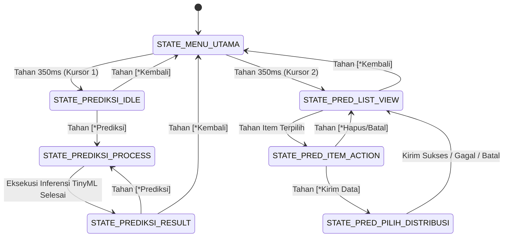

# SMART MILK QUALITY MONITORING & SHELF-LIFE PREDICTION SYSTEM

### Edge-AI On-Device TinyML Berbasis ESP32-S3 untuk Penjaminan Mutu Susu Sapi Segar dan Otomasi Logistik Rantai Dingin

---

## 1. RINGKASAN EKSEKUTIF & KONSEP SISTEM

### 1.1. Latar Belakang Masalah

Susu sapi segar merupakan bahan pangan hewani yang sangat mudah rusak (*highly perishable biological asset*). Pada peternakan rakyat di Indonesia, keterbatasan akses terhadap rantai pendingin aktif (*chilling unit*) menyebabkan susu tersimpan pada suhu kamar ($25^\circ\text{C} - 32^\circ\text{C}$) pascaperah. Suhu tropis ini memicu bakteri asam laktat (*Lactic Acid Bacteria* / LAB) merombak disakarida laktosa menjadi asam laktat secara eksponensial:

$$\text{C}_{12}\text{H}_{22}\text{O}_{11} + \text{H}_2\text{O} \xrightarrow{\text{Lactic Acid Bacteria}} 4\text{ CH}_3\text{CH(OH)COOH}$$

Akumulasi asam laktat melepaskan kation hidrogen ($H^+$) dan anion laktat ($CH_3CH(OH)COO^-$), menurunkan derajat keasaman (pH), dan meruntuhkan stabilitas misel kasein hingga susu pecah/menggumpal.

Metode pengujian konvensional di pos penampungan susu (KUD) masih mengandalkan **uji alkohol 70% manual** yang memiliki kelemahan:

1. Bersifat destruktif (merusak sampel uji).
2. Memerlukan belanja bahan kimia habis pakai secara rutin.
3. Bersifat **reaktif dan biner**: hanya mengetahui susu sudah pecah atau belum, tanpa mampu memprediksi berapa menit lagi susu tersebut akan bertahan sebelum rusak.

### 1.2. Solusi & Inovasi Teknologi

Sistem ini mengintegrasikan sensor biofisika cairan dengan kecerdasan buatan pada perangkat mikro (*On-Device TinyML*) menggunakan mikrokontroler **ESP32-S3**:

* **Pengujian Biofisika Non-Destruktif (< 2 Detik):** Mengukur dinamika suhu dan konduktivitas listrik cairan secara instan tanpa reagen kimia.


* **Multi-Task Edge Inference:** Menjalankan model *Multi-Task Multi-Layer Perceptron (MLP)* langsung di memori SRAM ESP32-S3. Sistem menghasilkan dua prediksi simultan:


1. **Klasifikasi Grade Mutu Biologis:** `GRADE_A` (Segar/Layak), `GRADE_B` (Peringatan Dini/Kritis), dan `GRADE_C` (Rusak/Asam).


2. **Regresi Sisa Masa Simpan (Countdown):** Estimasi waktu aman konsumsi/distribusi dalam menit ($0 - 360\text{ menit}$) dengan deviasi rata-rata hanya **4.07 menit**.


* **Zero-Dependency Native C++ Deployment:** Inferensi dijalankan via aljabar matriks C++ murni tanpa ketergantungan pada runtime interpreter TFLite Micro, menghasilkan latensi $< 0.1\text{ ms}$ dan alokasi memori dinamis 0 byte (Zero Heap/Arena).


* **Offline-First Telemetri:** Data pengujian diarsipkan secara persisten di partisi Flash LittleFS mikrokontroler dan dapat disinkronkan ke server web FastAPI KUD saat perangkat terhubung ke jaringan Wi-Fi.


---

## 2. ARSITEKTUR PERANGKAT KERAS & INSTRUMENTASI SENSOR

```
                  +-------------------------------------------------------+
                  |                     ESP32-S3 SoC                      |
                  |          Xtensa Dual-Core LX7 @ 240 MHz               |
                  |                512 KB SRAM / 8 MB Flash               |
                  +-------------------------------------------------------+
                     |          |          |          |          |     |
     +---------------+          |          |          |          |     +---------------+
     | (SPI Hardware)           | (I2C)    | (ADC)    | (GPIO)   | (GPIO)              | (GPIO)
     v                          v          v          v          v                     v
+---------------+       +------------+ +--------+ +--------+ +--------+          +-----------+
|   MAX31865    |       |  SSD1306   | | AC Div | | DriveA | | DriveB |          | RGB LED & |
|  RTD Amplifier|       | 0.96" OLED | | Sense  | | GPIO 4 | | GPIO 5 |          |  Button   |
+---------------+       +------------+ +--------+ +--------+ +--------+          +-----------+
     |                         |           |          |          |                     |
     v                         v           +----+-----+----------+                     v
[Probe PT100]           [128x64 Layar]          |                               [Indikator &]
(Suhu Presisi)          (Antarmuka FSM)         v                               [ Navigasi  ]
                                         [Probe Elektroda]
                                         [Stainless SS316]

```

### 2.1. Daftar Komponen & Konfigurasi Pinout

| Modul / Komponen | Tipe / Spesifikasi | Pin ESP32-S3 | Fungsi Teknis |
| --- | --- | --- | --- |
| **SoC Utama** | ESP32-S3-WROOM-1 | — | Unit pemroses utama & eksekusi Edge AI

 |
| **RTD Amplifier** | MAX31865 (SPI 2-Wire) | GPIO 10 (CS), 11 (MOSI), 12 (SCK), 13 (MISO) | Pembacaan hambatan temperatur PT100 presisi tinggi

 |
| **Probe Temperatur** | PT100 RTD Class A ($100\ \Omega$) | Terhubung ke MAX31865 | Deteksi suhu susu aktual (rentang $0^\circ\text{C} - 45^\circ\text{C}$)

 |
| **EC Drive A** | Output Digital GPIO | GPIO 4 | Generator eksitasi AC fase positif

 |
| **EC Drive B** | Output Digital GPIO | GPIO 5 | Generator eksitasi AC fase pembalik (negatif)

 |
| **EC Sense ADC** | Analog-to-Digital (ADC1_CH0) | GPIO 1 | Pengukuran tegangan jatuh divider susu ($V_{out}$)

 |
| **Resistor Referensi** | Metal Film $1.0\text{ k}\Omega$ (Toleransi 1%) | Antara GPIO 4 dan GPIO 1 | Pembagi tegangan referensi pembacaan konduktansi

 |
| **Elektroda EC** | Kawat Stainless Steel 316 | Ujung aktif terisolasi $5\text{ mm}$ | Sensor kontak ionik cairan susu

 |
| **Display OLED** | 0.96" I2C SSD1306 ($128 \times 64$) | GPIO 8 (SDA), GPIO 9 (SCL) | Antarmuka pengguna interaktif (FSM UI)

 |
| **Tombol Navigasi** | Push Button Taktil | GPIO 7 (Pull-Down internal) | Kendali tunggal (klik singkat vs tahan lama)

 |
| **Indikator RGB** | LED Common-Cathode | GPIO 15 (R), GPIO 16 (G), GPIO 17 (B) | Feedback status visual hasil klasifikasi mutu

 |

### 2.2. Desain Sirkuit Custom AC Voltage Divider (Anti-Elektrolisis)

Pengukuran konduktivitas listrik ($EC$) menggunakan arus searah (DC) murni akan menyebabkan polarisasi muatan ionik pada permukaan elektroda dan memicu korosi elektrolisis cairan. Sistem ini menerapkan teknik eksitasi bolak-balik berfrekuensi tinggi yang dibangkitkan secara langsung dari sepasang GPIO:

```
    [ESP32-S3 GPIO 4 (Drive A)] 
                 |
          [ Resistor Referensi ]
          [  R_ref: 1000 Ω (1%) ]
                 |
                 +-------------------> [ESP32-S3 GPIO 1 (ADC Sense)]
                 |
          [ Elektroda A (SS316) ]
                 ~  (Cairan Susu: R_liquid)
          [ Elektroda B (SS316) ]
                 |
    [ESP32-S3 GPIO 5 (Drive B)]

```

* **Siklus Eksitasi:** GPIO 4 diset `HIGH` (3.3V) dan GPIO 5 `LOW` (0V) selama $120\ \mu\text{s}$ untuk pembacaan ADC. Setelah pembacaan, polaritas dibalik secara instan (GPIO 4 `LOW`, GPIO 5 `HIGH`) selama $120\ \mu\text{s}$ guna menetralkan akumulasi muatan ionik di elektroda, diikuti jeda relaksasi $2\text{ ms}$.


* **Trimmed-Mean Filter:** Pengukuran dilakukan sebanyak 40 sampel. 8 sampel nilai terendah dan 8 sampel nilai tertinggi dibuang (*trimmed filtering*) untuk mengeliminasi lonjakan transien induktif. 24 sampel valid sisanya dirata-ratakan menjadi $V_{out}$.


* **Perhitungan Parameter Fisik & Kompensasi Suhu ($EC_{25}$):**

$$R_{\text{liquid}} = R_{\text{ref}} \cdot \left( \frac{V_{out}}{V_{in} - V_{out}} \right) \quad [\Omega]$$

$$EC_{\text{raw}} = \left( \text{Slope} \cdot \frac{1000}{R_{\text{liquid}}} \right) + \text{Offset} \quad [\text{mS/cm}]$$

$$EC_{25} = \frac{EC_{\text{raw}}}{1.0 + 0.020 \cdot (T - 25.0)} \quad [\text{mS/cm}]$$

---

## 3. PIPELINE DATASET & REKAYASA FITUR

```
[Dataset Mentah Eksperimen Lab]
              |
              v
[Pemisahan Fitur & Target Eliminasi Kolom Redundan]
(Buang: sample_id, timestamp, burst_idx, alcohol_test)
              |
              v
[Logistics Operational Capping (Max 360 Menit)]
              |
              v
[Stratified 80:20 Split Sebelum Augmentasi]
   +----------+----------+
   |                     |
   v                     v
[Data Uji Murni 20%]   [Data Latih 80%]
(68 Sampel Eksklusif)    (268 Sampel)
   |                     |
   |                     v
   |             [Targeted k-NN Local Interpolation]
   |             (Seimbangkan Grade B ke 50 Sampel Inti)
   |                     |
   v                     v
[Min-Max Scaler Transform] <--- [Fit Scaler pada Data Latih]
   |                                 |
   v                                 v
[Matriks Evaluasi Uji]         [Matriks Pelatihan Multi-Task]

```

### 3.1. Fitur Masukan ($X$) & Penentuan Label Target ($y$)

* **Fitur Input ($X$ - 4 Dimensi):**
1. `Suhu (°C)`: Temperatur cairan dari sensor PT100.


2. `R Liquid (Ohm)`: Hambatan resistansi murni cairan susu.


3. `EC Raw (mS/cm)`: Konduktivitas listrik cairan mentah.


4. `EC25 (mS/cm)`: Konduktivitas terkompensasi temperatur referensi $25^\circ\text{C}$.


* **Target Output ($y$ - Multi-Task):**
1. `grade_output` (Kategori Mutu): One-Hot Encoding dari `GRADE_A` ($> 90\text{ m}$), `GRADE_B` ($30 - 90\text{ m}$), dan `GRADE_C` ($< 30\text{ m}$).


2. `shelf_life_output` (Sisa Waktu): Nilai menit simpan ternormalisasi $[0, 1]$.


* **Eliminasi Redundansi `alcohol_test`:** Hasil uji alkohol manual dikeluarkan dari matriks masukan karena nilainya telah terpetakan ke dalam ground truth `label_grade`.


### 3.2. Capping Sisa Waktu Simpan (Operational Window)

Di laboratorium, susu dingin dapat bertahan hingga $> 2.500\text{ menit}$ ($> 40\text{ jam}$). Memasukkan rentang waktu ribuan menit ini ke dalam fungsi regresi menyebabkan pembengkakan magnitudo loss kuadratik (MSE) yang merusak akurasi model.

Target sisa waktu simpan dibatasi pada jendela operasional logistik harian:

$$\text{label\_shelf\_life\_min} = \min(360, \text{Sisa Menit Alami})$$

Langkah capping 360 menit (6 jam) memastikan resolusi inferensi terfokus penuh pada fase kritis degradasi susu.

### 3.3. Pencegahan Leakage & Targeted k-NN Local Interpolation

Untuk mengatasi ketimpangan kelas minoritas pada fase transisi (`GRADE_B` yang hanya berjumlah 21 baris di data latih) tanpa merusak distribusi alami:

1. **Stratified 80:20 Split:** Pemisahan dataset dilakukan di awal menggunakan stratifikasi kelas. Data uji murni (68 sampel) dikunci terisolasi dan **tidak pernah terkena augmentasi data**.


2. **k-NN Local Interpolation ($k=3$):** Penambahan data sintetis Grade B hanya diterapkan pada data latih dengan mencari 3 tetangga terdekat dalam ruang fitur fisik murni Grade B:

$$\vec{x}_{\text{sintetis}} = \vec{x}_i + \lambda (\vec{x}_j - \vec{x}_i), \quad \lambda \sim U(0.30, 0.70)$$

Teknik ini menaikkan jumlah sampel Grade B ke batas optimal (50 sampel) tepat di pusat klaster, mencegah meluasnya batas keputusan (*decision boundary*) ke area Grade C.

### 3.4. Konstanta Normalisasi Min-Max

Parameter skalar hasil *fitting* pada data latih yang ditanamkan pada firmware ESP32-S3:

```cpp
const float MIN_0   = 3.560000f;   // Suhu (°C)
const float SCALE_0 = 0.031867f;
const float MIN_1   = 253.300003f; // R Liquid (Ohm)
const float SCALE_1 = 0.003509f;
const float MIN_2   = 1.598000f;   // EC Raw (mS/cm)
const float SCALE_2 = 0.226655f;
const float MIN_3   = 2.565000f;   // EC25 (mS/cm)
const float SCALE_3 = 0.359583f;
const float SHELF_MAX_MINUTES = 360.0f;

```

---

## 4. PEMODELAN MACHINE LEARNING & DEPLOYMENT

```
                       [ Input Vector: 4 Dimensi ]
                     (Suhu, R_liquid, EC_raw, EC_25)
                                    |
                                    v
                     [ Shared Dense 1: 32 Neuron ]
                     [ Aktivasi: ReLU (He Normal) ]
                                    |
                                    v
                     [ Shared Dense 2: 16 Neuron ]
                     [ Aktivasi: ReLU (He Normal) ]
                                    |
                 +------------------+------------------+
                 |                                     |
                 v                                     v
    [ Head 1: Klasifikasi Grade ]         [ Head 2: Regresi Sisa Waktu ]
    [ Dense Layer: 3 Neuron ]             [ Dense Layer: 1 Neuron ]
    [ Aktivasi: Softmax ]                 [ Aktivasi: Linear ]
    [ Loss: Categorical Cross-Entropy ]   [ Loss: Mean Absolute Error (L1) ]
    [ Bobot Loss: 1.0 ]                   [ Bobot Loss: 12.0 ]
                 |                                     |
                 v                                     v
    Output: P(A), P(B), P(C)              Output: Sisa Waktu [0, 1]

```

### 4.1. Mengatasi Ketimpangan Magnitudo Gradien Multi-Task

Pada model multi-task konvensional dengan target regresi $[0, 1]$, deviasi error 10 menit menghasilkan nilai MSE kuadratik hanya $(10/360)^2 \approx 0.00077$. Nilai ini membuat magnitudo loss klasifikasi ($\approx 0.35$) mendominasi proses *backpropagation* dengan rasio $> 200 : 1$.

Sistem ini menerapkan dua langkah optimasi teoritis:

1. **Penerapan L1 Loss (MAE) pada Regresi:** Gradien L1 bernilai konstan ($\pm 1$) dan tidak lenyap saat nilai target berada dalam skala pecahan kecil.
2. **Keseimbangan Bobot Gradien 1:1 ($w_{\text{cls}}=1.0, w_{\text{reg}}=12.0$):**

$$\mathcal{L}_{\text{total}} = 1.0 \cdot \mathcal{L}_{\text{CCE}} + 12.0 \cdot \mathcal{L}_{\text{MAE}}$$

Dengan faktor pengali $12.0$, kontribusi gradien kedua cabang berada pada magnitudo seimbang ($\approx 0.33 \text{ vs } 0.35$), mencegah *EarlyStopping* mengalami bias terminasi sebelum regresi konvergen.

### 4.2. Hasil Evaluasi Akhir (Data Uji Murni 68 Sampel)

```text
=== 1. EVALUASI KLASIFIKASI MUTU SUSU ===
Overall Accuracy: 97.06%

Classification Report:
              precision    recall  f1-score   support
     GRADE_A       1.00      1.00      1.00        31
     GRADE_B       1.00      0.60      0.75         5
     GRADE_C       0.94      1.00      0.97        32
    accuracy                           0.97        68
   macro avg       0.98      0.87      0.91        68
weighted avg       0.97      0.97      0.97        68

Confusion Matrix:
[[31  0  0]   --> Grade A Sempurna (Zero False Negative ke A)
 [ 0  3  2]   --> Grade B Konservatif (3 Akurat, 2 ke C)
 [ 0  0 32]]  --> Grade C Sempurna (100% Terdeteksi)

=== 2. EVALUASI REGRESI SISA WAKTU (MENIT) ===
Mean Absolute Error (MAE) : 4.07 Menit
Root Mean Squared Error   : 8.95 Menit

```

* **Zero Contamination Risk:** Kolom `GRADE_A` bernilai murni `[31, 0, 0]`. Tidak ada susu rusak atau kritis yang terprediksi sebagai Grade A.
* **Fail-Safe Behavior:** Dua sampel Grade B yang meleset diklasifikasikan ke Grade C, memicu respons protektif penanganan darurat alih-alih meloloskannya ke tangki penyimpanan utama KUD.

### 4.3. Mengapa Native C++ FP32 Dipilih Dibandingkan INT8 TFLite Micro?

Model diekspor ke berkas header C++ mandiri `milk_model_weights.h`:

| Parameter | Native C++ FP32 (Sistem Ini) | TFLite Micro INT8 | Keunggulan Sistem Ini |
| --- | --- | --- | --- |
| **Kompabilitas ESP32 Core** | **Universal (Core v2.x & v3.x)**<br> | Sering gagal kompilasi pada Core v3.x (konflik Flatbuffers C++20) | Bebas dari *breaking changes* compiler eksternal |
| **Kebutuhan SRAM** | **$\approx 192\text{ bytes}$** (Array lokal) | Wajib memesan $8 - 16\text{ KB}$ Tensor Arena | Menghemat memori RAM mikrokontroler hingga 98% |
| **Presisi Prediksi** | **Identik 100%** dengan Python (MAE 4.07m) | Menurun akibat *quantization loss* | Akurasi estimasi menit tidak mengalami degradasi |
| **Pemanfaatan Hardware** | **FPU Akselerasi Hardware** (Xtensa LX7)

 | Operasi software *bit-shift* integer | Inferensi tuntas dalam waktu $< 0.1\text{ ms}$ |

Fungsi inferensi C++ dieksekusi secara instan:

```cpp
predictMilkModel(in_suhu, in_rohm, in_ecraw, in_ec25,
                 resultGrade, resultShelfLifeMin, SHELF_MAX_MINUTES);
```[cite: 2]

---

## 5. FIRMWARE & FINITE STATE MACHINE (FSM)

Firmware dirancang berbasis FSM non-blocking dengan navigasi satu tombol (*Single-Button Interface*) pada GPIO 7[cite: 2].



### 5.1. Logika Kendali Tombol Tunggal (GPIO 7)

* **Klik Singkat ($50 - 350\text{ ms}$):** Memindahkan posisi kursor navigasi pada menu.


* **Tekan & Tahan ($\ge 350\text{ ms}$):** Melakukan eksekusi pilihan/konfirmasi aksi.


* **Animasi Visual Progress Bar:** Layar OLED merender garis progres horizontal pada piksel paling bawah ($y=62, h=2$) saat tombol ditekan sebagai umpan balik visual sebelum aksi terpicu.


### 5.2. Mekanisme Proteksi Probe Kering (Dry-Probe Failsafe)

Sistem secara otomatis memvalidasi apakah sensor benar-benar terendam cairan susu atau berada di udara terbuka. Jika tegangan pembagi $V_{out} \ge 3.25\text{ V}$ atau $V_{out} \le 0.02\text{ V}$, sistem langsung menetapkan status `KERING`, menyalakan LED merah, dan menghentikan inferensi untuk mencegah kalkulasi palsu.

---

## 6. ARSITEKTUR TELEMETRI IOT & INTEGRASI FASTAPI

### 6.1. Penyimpanan Lokal Persisten (LittleFS)

Setiap kali pengujian berhasil, data disimpan ke dalam berkas internal `/prediksi_log.json`. Format data diarsipkan dalam bentuk JSON baris (*newline-delimited JSON*):

```json
{"device_id":"FARMMERRY-001","alamat":"Farm Mery, Mugirejo, Kec. Sungai Pinang","latitude":-0.480724,"longitude":117.202154,"suhu":28.45,"grade":"GRADE_A","sisa_waktu_menit":175}
```[cite: 2]

### 6.2. Sinkronisasi Data ke Server KUD
Saat pengguna memilih menu **Log & Kirim**, ESP32-S3 mengaktifkan modul Wi-Fi[cite: 2]:
1. **WiFiManager Captive Portal:** Jika koneksi Wi-Fi belum terkonfigurasi, perangkat membentuk Access Point darurat bernama `MILK-SETUP` (IP: `192.168.4.1`) untuk memudahkan konfigurasi SSID/password via smartphone[cite: 2].
2. **Pilihan Logistik Penjemputan:** Pengguna memilih metode distribusi: `DIJEMPUT` (armada KUD datang ke peternakan) atau `ANTAR` (peternak mengirim mandiri ke pos)[cite: 2].
3. **HTTP POST Payload ke FastAPI:** Data dikirimkan ke endpoint `/api/predict-log`[cite: 2]:

```json
[
  {
    "device_id": "FARMMERRY-001",
    "alamat": "Farm Mery, Mugirejo, Kec. Sungai Pinang",
    "latitude": -0.480724,
    "longitude": 117.202154,
    "suhu": 28.45,
    "grade": "GRADE_A",
    "sisa_waktu_menit": 175,
    "metode_pengiriman": "DIJEMPUT"
  }
]
```[cite: 2]

Ketika server merespons dengan status kode HTTP `200 OK`, item log yang bersangkutan otomatis dihapus dari memori Flash LittleFS untuk menghemat ruang simpan[cite: 2].

---

## 7. PANDUAN REPRODUKSI, INSTALASI, & PENGUJIAN

### 7.1. Pelatihan Model (Jupyter Notebook)
1. Buka folder pelatihan:
   ```bash
   cd "pelatihan/"
   source .venv/bin/activate
   jupyter notebook tiny-susu.ipynb
   ```[cite: 1]
2. Jalankan seluruh sel dari **Cell 1 hingga Cell 11**[cite: 1].
3. Jalankan sel ekspor C++ paling akhir untuk memperbarui berkas bobot `milk_model_weights.h`.

### 7.2. Kompilasi & Flash Firmware (Arduino IDE)
1. Salin berkas `milk_model_weights.h` ke dalam folder proyek firmware:
   ```bash
   cp "pelatihan/milk_model_weights.h" "prediksi-susu/"

```

2. Buka berkas `prediksi-susu/prediksi-susu.ino` di Arduino IDE.


3. Pasang library pendukung melalui Library Manager:
* `Adafruit GFX Library`

* `Adafruit SSD1306`

* `Adafruit MAX31865 library`

* `WiFiManager`


4. Konfigurasi board Arduino IDE:
* **Board:** `ESP32S3 Dev Module`
* **USB CDC On Boot:** `Enabled`
* **Flash Size:** `8MB (64Mb)`
* **Partition Scheme:** `Default 4MB with spiffs/littlefs`


5. Sambungkan perangkat ESP32-S3 via port USB-C dan klik **Upload**.