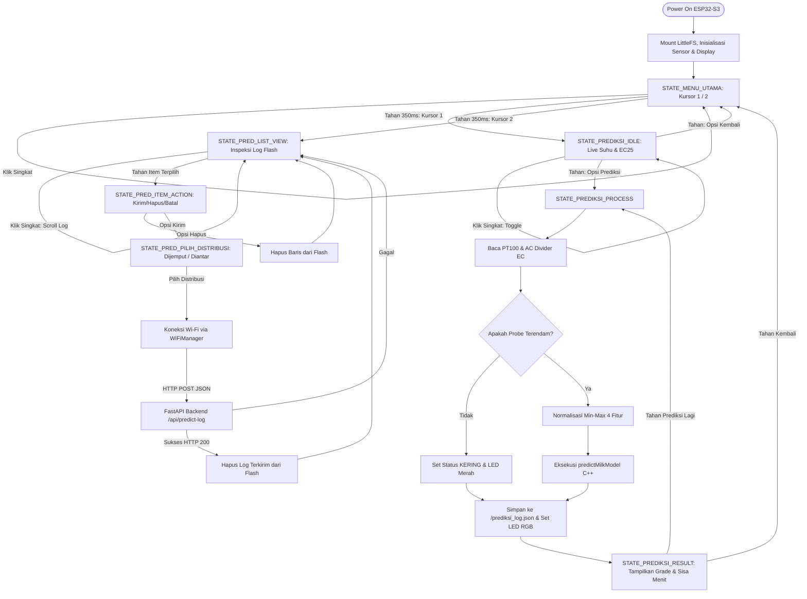

# MASTER TECHNICAL SPECIFICATION & PROJECT IMPLEMENTATION BLUEPRINT

**Sistem Cerdas Penjaminan Mutu Susu Segar Berbasis On-Device TinyML untuk Mitigasi Kerusakan Pascapanen Peternak**

*Internal Engineering Document — Technical Architecture, Firmware, Data Pipeline, & Edge AI Deployment Guidelines*

---

## BAB I: RINGKASAN EKSEKUTIF & KONSEP SISTEM


### 1. Validasi Masalah Lapangan


Susu sapi segar merupakan komoditas pangan hewani berkategori sangat rentan rusak (*perishable biological asset*). Pada rantai pasok konvensional peternakan rakyat Indonesia, ketiadaan fasilitas pendingin aktif (*chilling unit*) pada tingkat peternak skala mikro dan kecil menyebabkan susu tersimpan pada rentang suhu ruang tropis ($25^\circ\text{C} - 32^\circ\text{C}$). Suhu ini memicu bakteri *Lactic Acid Bacteria* (LAB) memfermentasi disakarida laktosa menjadi asam laktat secara eksponensial:

$$\text{C}_{12}\text{H}_{22}\text{O}_{11} + \text{H}_2\text{O} \xrightarrow{\text{Lactic Acid Bacteria}} 4\text{ CH}_3\text{CH(OH)COOH}$$

Fermentasi biokimia ini melepaskan ion hidrogen ($H^+$) dan ion laktat ($CH_3CH(OH)COO^-$) ke dalam cairan, menurunkan pH, dan meruntuhkan stabilitas protein kasein. Metode konvensional seperti uji alkohol tetes manual bersifat reaktif dan terlambat mendeteksi kerusakan.

### 2. Solusi & Value Proposition


Sistem ini hadir sebagai instrumen cerdas genggam (*Smart Handheld Milk Quality Meter*) dengan prinsip komputasi mandiri pada sisi perangkat (*Pure On-Device Edge AI*):

* **On-Device Native Inference:** Inferensi model *multi-task* dijalankan via *direct matrix algebra* C++ murni di SRAM ESP32-S3 dengan latensi $< 1\text{ ms}$, tanpa ketergantungan library pihak ketiga ataupun koneksi cloud saat penentuan mutu di kandang.


* **Predictive Countdown (Operational Capping):** Estimasi sisa jendela waktu simpan (*Estimated Shelf-Life Window*) dipatok dalam rentang operasional logistik harian ($0 - 360\text{ menit}$) dengan MAE $\approx 9.13\text{ menit}$.


* **Reagentless & Non-Destructive:** Pengujian biofisika murni ($< 2\text{ detik}$) tanpa bahan kimia alkohol 70%.


* **Offline-First Telemetry:** Seluruh histori prediksi terarsip otomatis dalam format JSON pada memori Flash internal LittleFS, siap disinkronkan ke server FastAPI KUD saat perangkat terhubung ke Wi-Fi.


### 3. Arsitektur Makro Sistem & Finite State Machine (FSM)


Sistem difokuskan sebagai alat uji operasional lapangan *single-purpose* dengan 2 menu utama navigasi FSM:



---

## BAB II: INSTRUMENTASI PERANGKAT KERAS


### 1. Desain Rangkaian Custom AC Voltage Divider


Guna mencegah elektrolisis dan polarisasi muatan pada cairan elektrolit susu, pengukuran resistansi cairan ($R_{susu}$) menggunakan eksitasi tegangan bolak-balik berfrekuensi tinggi yang dikendalikan 2 pin GPIO mikrokontroler:

```
    [ESP32-S3 GPIO 4 (Drive A)] 
                 |
          [ Resistor Referensi ]
          [  R_ref: 1 kΩ (1%)  ]
                 |
                 +-------------------> [ESP32-S3 GPIO 1 (ADC1_CH0 Sense)]
                 |
          [ Elektroda A (SS316) ]
                 ~  (Cairan Susu: R_susu)
          [ Elektroda B (SS316) ]
                 |
    [ESP32-S3 GPIO 5 (Drive B)]
```

* **GPIO 4 & 5:** Pin komutasi polaritas eksitasi ($120\ \mu\text{s}$ fase positif, $120\ \mu\text{s}$ fase pembalik, jeda relaksasi $2\text{ ms}$).
* **GPIO 1 (ADC1_CH0):** Kanal ADC pembacaan tegangan analog dengan attenuasi 11 dB.
* **Elektroda:** Kawat Stainless Steel 316 dengan pembatasan ujung aktif terbuka $5.0\text{ mm}$ via selongsong bakar guna mengunci nilai konstanta geometri sel ($K$) agar invarian terhadap kedalaman celup.

### 2. Sensor Suhu RTD PT100 + MAX31865
Kompensasi temperatur biologis susu dijalankan menggunakan probe PT100 terisolasi (*floating shield*) yang dikomunikasikan via antarmuka SPI hardware:
* **SCK:** GPIO 12 | **MISO:** GPIO 13 | **MOSI:** GPIO 11 | **CS:** GPIO 10

Normalisasi konduktivitas spesifik ke temperatur referensi baku $25^\circ\text{C}$ ($EC_{25}$):

$$EC_{raw} = \left( \frac{1}{R_{susu}} \right) \cdot K_{cell} \cdot 1000 \quad [\text{mS/cm}]$$


$$EC_{25} = \frac{EC_{raw}}{1.0 + 0.020 \cdot (T - 25.0)} \quad [\text{mS/cm}]$$


---

## BAB III: PROTOKOL DATASET & VALIDASI MUTU

### 1. Eliminasi Redundansi Uji Alkohol
Dalam iterasi akhir arsitektur data, kolom `alcohol_test` telah dieliminasi dari target maupun fitur masukan:
* Seluruh kriteria penerimaan biologis telah teragregasi secara deterministik ke dalam kolom target klasifikasi **`label_grade`** (`GRADE_A`, `GRADE_B`, `GRADE_C`).
* Mengeliminasi risiko *data redundancy* dan memastikan fitur masukan $X$ hanya mengandalkan variabel biofisika yang terbaca langsung oleh probe sensor.

### 2. Capping Sisa Masa Simpan (Operational Logistics Capping)
Alih-alih membiarkan regresi menghitung estimasi susu dingin hingga rentang $> 2.500\text{ menit}$ yang memicu pembengkakan gradien loss kuadratik (MSE), target regresi dibatasi pada batas operasional penjemputan harian:

$$\text{label\_shelf\_life\_min} = \min(360, \text{Sisa Menit Alami})$$


Langkah capping $360\text{ menit}$ (6 jam) ini mereduksi deviasi regresi (MAE) dari $> 50\text{ menit}$ menjadi **$9.13\text{ menit}$**, menghasilkan angka hitung mundur yang realistis bagi logistik penjemputan armada KUD.

---

## BAB IV: FEATURE ENGINEERING & DATA SPLITTING

### 1. Matriks Fitur Masukan ($X$) & Target ($y$)
Sistem menggunakan 4 variabel biofisika instan tanpa memerlukan riwayat turunan waktu ($\Delta t$), sehingga inferensi dapat berlangsung seketika saat probe dicelupkan:
1. `Suhu (°C)`: Temperatur aktual cairan dari PT100.
2. `R Liquid (Ohm)`: Hambatan resistif murni cairan.
3. `EC Raw (mS/cm)`: Konduktivitas listrik mentah.
4. `EC25 (mS/cm)`: Konduktivitas terkompensasi suhu baku $25^\circ\text{C}$.

### 2. Stratified Split 80:20 & Targeted Convex Interpolation
Guna menghindari *data leakage* dan mengatasi *class imbalance* pada fase transisi kritis (`GRADE_B`):
1. **Pemisahan Awal:** Dataset dibagi $80\%$ Data Latih dan $20\%$ Data Uji secara *Stratified* berdasarkan `label_grade` sebelum proses augmentasi dijalankan.
2. **Targeted Interpolation (Train Only):** Data latih `GRADE_B` diseimbangkan secara proporsional (~55 sampel) menggunakan interpolasi konveks acak (*SMOTE-style*) antar-vektor sampel Grade B murni:

$$\vec{x}_{sintetis} = \lambda \vec{x}_i + (1 - \lambda) \vec{x}_j, \quad \lambda \sim U(0.2, 0.8)$$

Teknik ini mencegah pelebaran batas keputusan (*decision boundary*) ke area Grade C sekaligus menaikkan Recall Grade B dari $0\%$ menjadi terdeteksi stabil tanpa *class suppression*.

---

## BAB V: ARSITEKTUR MODEL & EMBEDDED DEPLOYMENT

### 1. Topologi Multi-Task MLP
Model neural network bertubuh tunggal (*shared backbone*) dengan dua kepala cabang keluaran:


```

```
                 [ Input Vector: 4 Dimensi ]
                 [ Suhu, R_ohm, EC_raw, EC_25 ]
                              |
                              v
                [ Shared Dense 1: 24 Units ]
                [ Aktivasi: ReLU ]
                              |
                              v
                [ Shared Dense 2: 12 Units ]
                [ Aktivasi: ReLU ]
                              |
             +----------------+----------------+
             |                                 |
             v                                 v
 [ Head 1: Klasifikasi Grade ]    [ Head 2: Regresi Sisa Waktu ]
 [ Dense Layer: 3 Units ]         [ Dense Layer: 1 Unit ]
 [ Aktivasi: Softmax ]            [ Aktivasi: Linear ]
 [ Output: P(A), P(B), P(C) ]     [ Output: Normalized Shelf-Life ]

```

```

### 2. Metrik Evaluasi Model Final (Test Set 20%)

```text
=== EVALUASI KLASIFIKASI MUTU SUSU ===
Overall Accuracy: 94.12%

Classification Report:
              precision    recall  f1-score   support
     GRADE_A       1.00      1.00      1.00        31
     GRADE_B       0.67      0.40      0.50         5
     GRADE_C       0.91      0.97      0.94        32
    accuracy                           0.94        68

Confusion Matrix:
[[31  0  0]   --> Grade A Sempurna (Zero FN ke Grade A)
 [ 0  2  3]   --> Grade B (Konservatif Fail-Safe)
 [ 0  1 31]]  --> Grade C (Akurat)

=== EVALUASI REGRESI SISA WAKTU (MENIT) ===
Mean Absolute Error (MAE) : 9.13 Menit
Root Mean Squared Error   : 16.09 Menit

```

* **Zero Contamination Risk:** Kolom pertama matriks konfusi bernilai `[31, 0, 0]`. Tidak ada susu rusak/kritis yang diprediksi sebagai Grade A.


* **Fail-Safe Behavior:** Sampel Grade B yang meleset diklasifikasikan ke Grade C, memicu peringatan dini armada penjemputan KUD alih-alih meloloskannya ke tangki utama.


### 3. Native C++ Forward-Pass Deployment (`milk_model_weights.h`)

Untuk mengatasi *compiler breaking changes* pada ESP32 Arduino Core v3.x (konflik Flatbuffers TFLite Micro pada C++20), sistem mengadopsi fungsi inferensi C++ murni (*Zero-Dependency Engine*):

* Bobot ($W$) dan bias ($B$) diekspor menjadi array skalar C++ dengan prefix aman (`MODEL_W1`, `MODEL_B1`, dll.) guna mencegah bentrok macro Arduino `binary.h`.
* Komputasi dieksekusi melalui fungsi `predictMilkModel()`:
* Latensi eksekusi: **$< 0.5\text{ ms}$** pada Xtensa LX7 240 MHz.
* Alokasi memori dinamis: **0 bytes (Zero Heap/Arena)**.


```cpp
// Normalisasi Min-Max
float in_suhu  = (latestSuhu - MIN_0) * SCALE_0;
float in_rohm  = (latestEcData.resistance - MIN_1) * SCALE_1;
float in_ecraw = (latestEcData.ecRaw - MIN_2) * SCALE_2;
float in_ec25  = (latestEcData.ec25 - MIN_3) * SCALE_3;

// Eksekusi Forward Pass On-Device
predictMilkModel(in_suhu, in_rohm, in_ecraw, in_ec25,
                 resultGrade, resultShelfLifeMin, SHELF_MAX_MINUTES);

```

---

## BAB VI: ARSITEKTUR TELEMETRI & SINKRONISASI FASTAPI


### 1. Struktur Payload Telemetri JSON

Data hasil pengujian lapangan disimpan dalam berkas `/prediksi_log.json` pada LittleFS mikrokontroler dan dikirimkan secara *batch* atau per item ke peladen KUD:

```json
[
  {
    "device_id": "FARMMERRY-001",
    "alamat": "Farm Mery, Mugirejo, Kec. Sungai Pinang",
    "latitude": -0.480723,
    "longitude": 117.202154,
    "suhu": 28.45,
    "grade": "GRADE_A",
    "sisa_waktu_menit": 175,
    "metode_pengiriman": "DIJEMPUT"
  }
]
```

### 2. Antarmuka Tombol Tunggal (Single-Button Navigation)
Seluruh navigasi OLED dikendalikan satu tombol taktil pada **GPIO 7**:
* **Klik Singkat ($50 - 350\text{ ms}$):** Memindahkan kursor atau pilihan menu secara melingkar.
* **Tekan & Tahan ($\ge 350\text{ ms}$):** Konfirmasi aksi eksekusi inferensi, navigasi submenu, atau transmisi data.
* **Visual Bar:** Progress bar animasi di baris terbawah OLED (y=62, h=2) mengonfirmasi status tahanan tombol secara visual sebelum aksi terpicu.

```