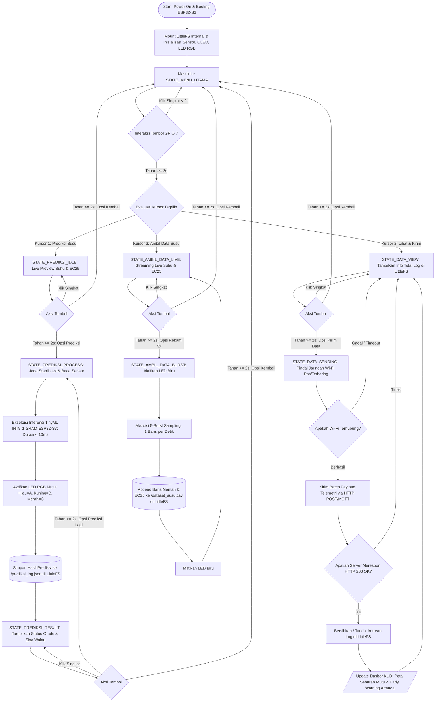
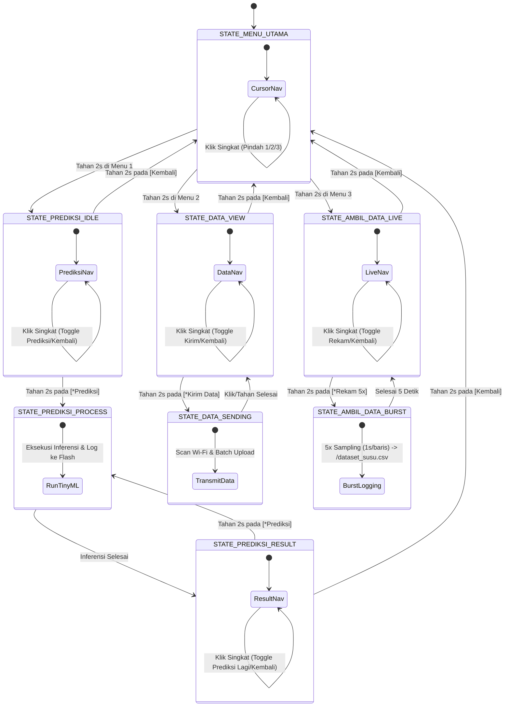

# MASTER TECHNICAL SPECIFICATION & PROJECT IMPLEMENTATION BLUEPRINT

**Sistem Cerdas Penjaminan Mutu Susu Segar Berbasis On-Device TinyML untuk Mitigasi Kerusakan Pascapanen Peternak**

*Internal Engineering Document — Technical Architecture, Firmware, Data Pipeline, & Edge AI Deployment Guidelines*

---

## BAB I: RINGKASAN EKSEKUTIF & KONSEP SISTEM

### 1. Validasi Masalah Lapangan

Susu sapi segar merupakan komoditas pangan hewani berkategori sangat rentan rusak (*perishable biological asset*). Pada rantai pasok konvensional peternakan rakyat Indonesia, titik kritis penurunan mutu (*quality degradation bottleneck*) terjadi tepat pada fase pascapanen (*post-harvest cold-chain*) selama masa tunggu di area kandang sebelum penjemputan armada Koperasi Unit Desa (KUD).

Ketiadaan fasilitas pendingin aktif (*chilling unit*) pada tingkat peternak skala mikro dan kecil menyebabkan susu tersimpan pada rentang suhu ruang tropis ($25^\circ\text{C} - 32^\circ\text{C}$). Suhu ini merupakan lingkungan termal optimal bagi koloni bakteri alami susu, khususnya *Lactic Acid Bacteria* (LAB), untuk memasuki fase eksponensial (*log phase*). Bakteri ini memetabolisme disakarida laktosa menjadi asam laktat secara cepat:

$$\text{C}_{12}\text{H}_{22}\text{O}_{11} + \text{H}_2\text{O} \xrightarrow{\text{Lactic Acid Bacteria}} 4\text{ CH}_3\text{CH(OH)COOH}$$

Fermentasi biokimia ini melepaskan ion hidrogen ($H^+$) dan ion laktat ($CH_3CH(OH)COO^-$) ke dalam matriks cairan, yang secara simultan menurunkan derajat keasaman ($pH$) dan meruntuhkan stabilitas misel protein kasein.

Akibatnya, saat susu tiba di pos penampungan KUD setelah melewati masa angkut 2–4 jam, keasaman telah melampaui ambang batas penolakan. Kondisi ini menyebabkan ribuan liter susu ditolak secara sepihak oleh KUD maupun Industri Pengolahan Susu (IPS), memicu fenomena pembuangan susu (*food waste*) dan kerugian finansial langsung bagi peternak.

Metode pengujian konvensional di pos penampungan (seperti uji alkohol tetes manual atau uji *lactodensimeter*) bersifat **reaktif** dan **lagging**—hanya mendeteksi susu yang telah terlanjur rusak tanpa memberikan indikasi prediktif tentang sisa durasi masa simpan susu yang masih segar.

### 2. Solusi & Value Proposition

Sistem ini dirancang sebagai instrumen cerdas genggam (*Smart Handheld Milk Quality Meter*) dengan prinsip komputasi mandiri pada sisi perangkat (*Pure On-Device Edge AI*).

```
+---------------------------------------------------------------------------------------------------+
|                                  VALUE PROPOSITION ARSITEKTUR                                     |
+------------------------------+--------------------------------------------------------------------+
| On-Device Processing         | Inferensi TinyML INT8 di ESP32-S3 < 10 ms; zero-dependency         |
|                              | terhadap cloud/internet saat pengambilan keputusan di kandang      |
+------------------------------+--------------------------------------------------------------------+
| Predictive Countdown         | Estimasi sisa jendela waktu simpan (Estimated Shelf-Life Window)   |
|                              | dalam satuan menit secara dinamis terhadap dinamika termal         |
+------------------------------+--------------------------------------------------------------------+
| Non-Destructive & Reagentless| Pengujian biofisika murni (< 3 detik); mengeliminasi ketergantungan|
|                              | terhadap alkohol 70% dan bahan kimia laboratorium                  |
+------------------------------+--------------------------------------------------------------------+
| Offline-First Architecture   | Pencatatan log terstempel waktu lokal di MicroSD; auto-sync        |
|                              | asinkron ke cloud KUD begitu mendeteksi jaringan Wi-Fi             |
+------------------------------+--------------------------------------------------------------------+

```

### 3. Arsitektur Makro Sistem

Diagram alir kerja (*Flowchart*) end-to-end diperbarui untuk mencerminkan sistem *offline-first* berbasis partisi Flash internal **LittleFS**, navigasi menu **Finite State Machine (FSM)**, dan interaksi **Dual-Action Button** (Klik: Navigasi, Tahan 2 Detik: Eksekusi):



#### Alur Operasional Pipeline:

* **Inisialisasi & Partisi Flash Lokal:** Saat sistem menyala, ESP32-S3 memvalidasi partisi LittleFS untuk memastikan kesiapan berkas `/dataset_susu.csv` dan `/prediksi_log.json` sebelum masuk ke menu utama.


* **Mode Prediksi Mutu (Edge Inference):** Pengujian susu dilakukan secara *on-demand* dengan komputasi mandiri di memori SRAM tanpa ketergantungan sinyal internet, memberikan *feedback* visual instan melalui OLED dan LED RGB serta pengarsipan riwayat prediksi ke Flash.


* **Mode Pengambilan Dataset (R&D Lab Protocol):** Memfasilitasi perekaman *5-burst sampling* berurutan selama 5 detik ke berkas CSV internal untuk menangkap variasi mikroskopis sensor (*jitter augmentation*) saat pengambilan data di lapangan.


* **Mode Sinkronisasi Asinkron (Batch Spooling):** Pengiriman data ke *cloud* KUD dijalankan secara sadar (*on-demand*) pada menu terpisah ketika perangkat berada di area yang terjangkau jaringan Wi-Fi, menghemat konsumsi daya baterai secara signifikan.

---

## BAB II: INSTRUMENTASI PERANGKAT KERAS (HARDWARE & SENSING)

### 1. Desain Rangkaian Custom AC Voltage Divider

Pengukuran konduktivitas listrik cairan elektrolit tidak dapat menggunakan sumber arus searah (DC). Arus DC memicu fenomena **elektrolisis** (disosiasi molekul air menjadi gas $H_2$ dan $O_2$) dan **polarisasi elektroda** (akumulasi ion lawan muatan pada permukaan logam yang membentuk lapisan dielektrik isolator). Hal ini mengakibatkan degradasi probe akibat oksidasi serta penurunan drastis pembacaan arus setelah beberapa detik.

Sistem menggunakan metode **Eksitasi Tegangan Bolak-Balik Frekuensi Tinggi (Custom AC Divider)** yang dikontrol secara digital melalui 2 pin GPIO ESP32-S3:

```
    [ESP32-S3 GPIO 4 (Drive A)] 
                 |
          [ Resistor Referensi ]
          [  R_ref: 1 kΩ (1%)  ]
                 |
                 +-------------------> [ESP32-S3 GPIO 1 (ADC1_CH0 Sense)]
                 |
          [ Elektroda A (SS316) ]
                 ~  (Cairan Susu: R_susu)
          [ Elektroda B (SS316) ]
                 |
    [ESP32-S3 GPIO 5 (Drive B)]

```

#### Spesifikasi Pinout Mikrokontroler ESP32-S3:

* **GPIO 4 (Drive A):** Pin output digital fase positif ($3.3\text{ V}$).


* **GPIO 5 (Drive B):** Pin output digital fase pembalik polaritas ($0\text{ V}$).


* **GPIO 1 (ADC1_CH0):** Pin pembacaan tegangan analog ($V_{out}$). Kanal ADC1 dipilih karena memiliki isolasi sirkuit terhadap modul radio Wi-Fi/Bluetooth, mencegah *analog saturation* atau gangguan saat transmisi data nirkabel aktif.


#### Siklus Eksitasi AC Mikro (<1 ms per sampel):

1. **Fase Eksitasi Positif ($100\ \mu\text{s}$):** GPIO 4 diset `HIGH` ($3.3\text{ V}$), GPIO 5 diset `LOW` ($0\text{ V}$). Arus mengalir dari Elektroda A ke B. Pin ADC membaca $V_{out}$.


2. **Fase Pembalikan Polaritas ($100\ \mu\text{s}$):** GPIO 4 diset `LOW` ($0\text{ V}$), GPIO 5 diset `HIGH` ($3.3\text{ V}$). Elektron dialirkan berbalik arah untuk menetralkan penumpukan muatan pada probe.


3. **Fase Relaksasi / Floating ($2\text{ ms}$):** Kedua pin diset `LOW` (mode mati) untuk membiarkan medan elektrokimia larutan berada dalam kondisi setimbang (*electrostatic relaxation*).


Perhitungan resistansi cairan ($R_{susu}$) didasarkan pada hukum pembagi tegangan:

$$R_{susu} = R_{ref} \cdot \left( \frac{V_{out}}{V_{in} - V_{out}} \right)$$

Dimana $V_{in} = 3.3\text{ V}$ dan $R_{ref} = 1000\ \Omega$ (toleransi 1% *metal-film*).

### 2. Standarisasi Probe Elektroda

Konduktansi larutan ($G$) memiliki relasi langsung dengan luas penampang elektroda ($A$), jarak celah antar-elektroda ($d$), dan konduktivitas spesifik larutan ($EC$):

$$G = \frac{1}{R_{susu}} = EC \cdot \frac{A}{d} = \frac{EC}{K}$$

Dimana $K = \frac{d}{A}$ didefinisikan sebagai **Konstanta Geometri Sel Probe ($cm^{-1}$)**.

```
                <--- d = 5-8 mm --->
                |                  |
           +----+----+        +----+----+
           |  SS316  |        |  SS316  |
           | Kawat   |        | Kawat   |
           | Ø 2.0mm |        | Ø 2.0mm |
           |         |        |         |
           | [ISOLASI]        | [ISOLASI]
           | Selong- |        | Selong- |
           |  song   |        |  song   |
           |  Bakar  |        |  Bakar  |
           | (Heat-  |        | (Heat-  |
           | Shrink) |        | Shrink) |
           |         |        |         |
           +----+----+        +----+----+
                |                  |  
                |  Ujung Aktif     |  h = 5.0 mm (Presisi)
                |  Logam Terbuka   |  [Titik Kontak Ionik]
                +------------------+

```

#### Alasan Ilmiah Pembatasan Ujung Aktif 5.0 mm:

1. **Invariansi Konstanta Sel Terhadap Kedalaman Celup:** Jika kawat dibiarkan terbuka sepanjang 3–5 cm, kedalaman celup yang berbeda akan mengubah nilai luas area basah ($A = 2\pi r \cdot h$). Akibatnya, nilai $K$ berfluktuasi secara masif di setiap pengujian. Isolasi selongsong bakar (*heat-shrink tube*) mengunci panjang basah elektroda secara kaku pada $h = 5.0\text{ mm}$, menjamin nilai $K$ bernilai konstan ($100\%$ invarian) tidak peduli seberapa dalam probe dimasukkan ke dalam wadah susu.


2. **Impedance Matching ke Zona Linear ADC ESP32-S3:** Konduktivitas susu murni relatif tinggi ($4.0 - 7.0\text{ mS/cm}$). Kawat telanjang panjang akan memperbesar $A$, menurunkan resistansi cairan hingga $<30\ \Omega$. Pada pembagi tegangan $1\text{ k}\Omega$, tegangan $V_{out}$ jatuh di bawah $0.1\text{ V}$—masuk ke *dead-zone* ADC ESP32 yang non-linear. Ujung aktif $5.0\text{ mm}$ menahan resistansi cairan pada rentang optimal $150\ \Omega - 300\ \Omega$, menghasilkan rentang tegangan $0.4\text{ V} - 0.7\text{ V}$ yang berada tepat di tengah area paling linear dan minim *noise* dari ADC1.


3. **Pemberantasan Efek Fringe Field & Kapasitansi Lapisan Ganda ($C_{dl}$):** Ujung 5 mm membatasi jalur medan listrik hanya melintas rapat di antara kedua elektroda (berfungsi sebagai *point electrodes*), meniadakan distorsi medan liar (*stray fields*) akibat dinding wadah seng atau aluminium. Luas permukaan kecil juga menekan nilai kapasitansi parasitik antarmuka logam-cairan ($C_{dl}$).


4. **Anti-Biofouling Lemak & Kasein:** Globula lipid dan misel protein susu sangat mudah teradsorpsi pada permukaan logam. Area kontak aktif seluas $5\text{ mm}$ memiliki rasio bilas (*rinse ratio*) tinggi, mencegah penumpukan kerak isolator lemak secara akumulatif.


### 3. Integrasi Sensor Suhu RTD PT100 + MAX31865

Kompensasi termal wajib dilakukan karena konduktivitas listrik cairan memiliki koefisien temperatur positif sebesar $\alpha \approx 2.0\% / ^\circ\text{C}$. Fluktuasi suhu sebesar $5^\circ\text{C}$ dapat membiaskan pembacaan EC hingga $10\%$, yang dapat mengacaukan pembedaan status mutu.

Sistem menggunakan probe RTD PT100 Platinum kelas industri *food-grade* yang dihubungkan ke IC amplifier presisi MAX31865 dengan topologi 3-kawat (*3-wire configuration*).

#### Konfigurasi Bus SPI ESP32-S3:

* **SCK:** GPIO 12


* **MISO:** GPIO 13


* **MOSI:** GPIO 11


* **CS (Chip Select):** GPIO 10


#### Mitigasi Interferensi Elektrik (*Floating Shield Protection*):

Selongsong logam stainless steel sensor PT100 merupakan konduktor yang tercelup bersamaan ke dalam susu. Jika selongsong PT100 terhubung ke ground sirkuit (GND ESP32), arus eksitasi AC dari probe EC akan mengalami kebocoran (*ground-loop leakage*), membiaskan kurva pembagi tegangan dan merusak integritas data suhu pada MAX31865. Selubung logam PT100 **wajib dibiarkan mengambang (*isolated floating shield*)** terhadap sirkuit daya mikrokontroler, dengan jarak fisik minimum 1.5 cm dari probe EC pada *housing casing*.

### 4. Pipeline & Time-Multiplexing Sensor

Untuk menjamin tidak adanya tabrakan gelombang listrik di dalam cairan, firmware menerapkan **Time-Multiplexing Sequence**:

```
Time (s)  0.0            3.0       3.1           3.3           3.31
          |---------------|---------|-------------|-------------|
Operasi:  Stabilisasi     Baca      Eksitasi AC   Kompensasi    Inferensi
          Termal          PT100     & Baca EC     EC25          TinyML
Status:   Probe Masuk     EC: OFF   PT100: IDLE   Matematika    Output

```

1. **Fase Stabilisasi Termal ($t = 0.0\text{ s} - 3.0\text{ s}$):** Memberikan jeda waktu bagi selongsong probe untuk mencapai kesetimbangan termodinamika cairan susu (*thermal equilibrium*).


2. **Fase Pembacaan Suhu ($t = 3.0\text{ s} - 3.1\text{ s}$):** Pin GPIO 4 dan 5 dikunci pada level `LOW` (mati total). ESP32-S3 membaca register resistansi RTD melalui bus SPI MAX31865 (waktu konversi internal ADC MAX31865: $\approx 65\text{ ms}$). Suhu aktual susu ($T$) tersimpan.


3. **Fase Pembacaan Konduktivitas ($t = 3.1\text{ s} - 3.3\text{ s}$):** Jalur SPI PT100 di-idle-kan. Sistem mengaktifkan burst eksitasi AC bolak-balik selama 200 ms untuk mengambil 50 sampel ADC oversampling, lalu menghitung nilai median $R_{susu}$. Pin penggerak dikembalikan ke status `LOW`.


4. **Fase Kompensasi Termal Non-Linear ($t = 3.3\text{ s}$):** Konduktivitas mentah dihitung dan dinormalisasi secara non-linear ke temperatur referensi baku $25^\circ\text{C}$ ($EC_{25}$) menggunakan koefisien kompensasi susu murni $\alpha = 0.020$:


$$EC_{raw} = \left( \frac{1}{R_{susu}} \right) \cdot K_{cell} \cdot 1000 \quad [\text{mS/cm}]$$

$$EC_{25} = \frac{EC_{raw}}{1.0 + \alpha \cdot (T - 25.0)} \quad [\text{mS/cm}]$$

---

## BAB III: PROTOKOL PENGUMPULAN DATA & VALIDASI BIOKIMIA

### 1. Skenario Variasi Suhu Eksperimen

Pelatihan model prediktif multivariat memerlukan dataset runtun waktu yang memetakan dinamika degradasi biologis susu di bawah berbagai tekanan termal lingkungan. Pengujian dilakukan simultan menggunakan 3 wadah toples susu segar murni (masing-masing 1.5 Liter, perahan hari yang sama dari sapi perah sehat) selama durasi 6 jam penuh (360 menit):

```
+---------------------------------------------------------------------------------------------------+
|                               SKENARIO MATRIKS UJI SUHU LINGKUNGAN                                |
+------------------+----------------+---------------------------------------------------------------+
| Sampel / Wadah   | Rentang Suhu   | Karakteristik Biologis & Peran Pelatihan                      |
+------------------+----------------+---------------------------------------------------------------+
| Wadah Dingin     | 10°C – 15°C    | Simulasi penggunaan cooler box es peternak. Laju pembelahan   |
| (S_DINGIN)       | (Cooler Box)   | bakteri tertekan dalam lag phase panjang. Memasok data Grade A|
|                  |                | stabil dan bertindak sebagai negative control (censored data).|
+------------------+----------------+---------------------------------------------------------------+
| Wadah Ruang      | 25°C – 30°C    | Kondisi riil kandang/pos KUD tropis. Bakteri aktif membelah   |
| (S_RUANG)        | (Ambient)      | pada jam ke-2 hingga ke-4; kurva baseline degradasi normal|
+------------------+----------------+---------------------------------------------------------------+
| Wadah Hangat     | 35°C – 38°C    | Accelerated shelf-life testing (pembusukan dipercepat akibat  |
| (S_HANGAT)       | (Water Bath)   | paparan terik matahari bak pengangkut terbuka). Kerusakan masif|
|                  |                | terjadi dalam 1.5 – 2.5 jam.                                 |
+------------------+----------------+---------------------------------------------------------------+

```

### 2. SOP Pengambilan Sampel Celup Berkala

Guna mencegah fenomena *fouling* lapisan lipid pada probe, eksperimen menggunakan **Metode Celup Berkala (*Intermittent Dipping Protocol*)**:

```
      [Interval Diam: 10 Menit]
           (Probe di Udara)
                  |
                  v
       [Aduk Susu Perlahan 3s]
                  |
                  v
    [Celupkan Probe: Total 10-15s]
    - Detik 0-3 : Penyetaraan Suhu Logam (Settling Time)
    - Detik 4-8 : 5-Burst Sampling (1 Baris Data / Detik)
    - Detik 9-10: Angkat Probe dari Susu
                  |
                  v
   [Protokol Pembilasan & Sanitasi]
   - Semprot Aquades Deionisasi (Melarutkan Sisa Kasein/Lemak)
   - Tepuk Kering Menggunakan Tisu Bebas Serat (Lint-Free)
                  |
                  v
       [Kembali ke Interval Diam]

```

* **Interval Siklus:** Dilakukan tepat setiap **10 menit sekali** pada ketiga wadah secara bergiliran.


* **Mekanisme 5-Burst Sampling:** Saat probe tercelup di detik ke-4 hingga ke-8, mikrokontroler merekam 5 kali pembacaan berturut-turut ($1\text{ baris data per detik}$). Kelima baris ini menangkap fluktuasi derau mikroskopis ADC di lapangan, yang berfungsi sebagai augmentasi alami (*sensor jitter augmentation*) agar model tidak *overfit* terhadap angka diskrit.


### 3. Ground Truth Benchmarking

Label biologis mutlak (*ground truth*) diuji secara paralel setiap **30 menit** (pada menit ke-0, 30, 60, ..., 360) sebagai titik jangkar (*anchor points*):

#### SOP Uji Alkohol 70% Standar Penerimaan Industri:

1. Ambil tepat $1.0\text{ ml}$ susu menggunakan spuit tanpa jarum berukuran $1\text{ ml}$.


2. Tuangkan ke dalam cup plastik mini transparan atau sendok stainless steel bersih.


3. Tambahkan $1.0\text{ ml}$ alkohol $70\%$ menggunakan spuit kedua (rasio volumetrik mutlak $1:1$).


4. Putar melingkar perlahan selama 5 detik, lalu amati dinding wadah di bawah penyinaran cahaya:


* **`NEGATIF`:** Cairan mengalir mulus, homogen, tidak meninggalkan butiran pasir.


* **`SERPIHAN_HALUS`:** Tampak partikel mikro atau pasir halus menempel di dinding wadah saat dimiringkan.


* **`PECAH_PADAT`:** Terkoagulasi masif menyerupai bubur tahu; cairan bening (*whey*) memisah jelas dari dadih (*curd*).


#### Logika Penanganan Wadah Dingin (Negative Control & Censored Data):

Susu pada wadah dingin ($10^\circ\text{C} - 15^\circ\text{C}$) tidak akan pecah/rusak dalam rentang pengujian 6 jam. Dalam teori reliabilitas machine learning, kondisi ini merupakan *right-censored biological data* yang sangat valid.

* Seluruh data wadah dingin dari menit ke-0 hingga ke-360 diberi label mutu mutlak: **`GRADE_A`** (karena hasil uji alkohol selalu negatif).


* Untuk target regresi sisa waktu (`label_shelf_life_min`), sistem menerapkan **Metode Capping Batas Operasional Maksimum (360 Menit)**. Selama suhu $\le 15^\circ\text{C}$ dan konduktivitas stabil, nilai dipatok pada batas atas $360\text{ menit}$. Hal ini menjaga distribusi loss fungsi regresi tetap stabil tanpa terdistorsi oleh angka ekstrapolasi tak hingga.


---

## BAB IV: MANAJEMEN DATASET & FEATURE ENGINEERING

### 1. Skema Tabel CSV Mentah

Berkas pencatatan gabungan dari MicroSD ESP32-S3 dan log pengujian manual laboratorium disimpan dengan spesifikasi kolom terstruktur:

```
+---------------------------------------------------------------------------------------------------+
|                                    SKEMA STRUKTUR DATASET MENTAH                                  |
+---------------------+---------+-------------------+-----------------------------------------------+
| Nama Kolom          | Tipe    | Kategori Pipeline | Definisi & Penjelasan Teknis                  |
+---------------------+---------+-------------------+-----------------------------------------------+
| sample_id           | String  | Metadata (Drop)   | Identitas wadah: 'S_RUANG', 'S_DINGIN', dll.|
| timestamp           | Int64   | Metadata (Drop)   | Unix epoch time (detik) saat pengujian   |
| elapsed_min         | Int32   | Temporal Operator | Menit relatif sejak awal perah (penyebut Δt).|
| burst_idx           | Int8    | Metadata (Drop)   | Indeks urutan sampling burst (1 sampai 5).    |
| temp_c              | Float32 | Feature Input (X) | Temperatur aktual susu (°C) dari PT100  |
| r_liquid            | Float32 | Sensor Mentah(Drop)| Hambatan analog cairan mentah (Ohm)     |
| ec_25               | Float32 | Feature Input (X) | Konduktivitas cairan suhu standar 25°C (mS/cm)|
| alcohol_test        | String  | Ground Truth(Drop)| Hasil uji alkohol: NEGATIF, dll.    |
| label_grade         | String  | Target Output (y1)| Kelas mutu biologis (GRADE_A, B, C)     |
| label_shelf_life_min| Float32 | Target Output (y2)| Hitung mundur sisa waktu aman (menit)   |
+---------------------+---------+-------------------+-----------------------------------------------+

```

### 2. Data Preprocessing & Pipeline Cleaning

Sebelum dataset disalurkan ke pipeline model, proses pembersihan dijalankan dengan urutan ketat:

```
[CSV Mentah]
     |
     v
[Agregasi 5-Burst Sampling per Sesi (Mean temp_c & ec_25)]
     |
     v
[Perhitungan delta_ec_rate (Delta EC25 / Delta t) via elapsed_min]
     |
     v
[Eliminasi Metadata & Raw Columns (sample_id, timestamp, r_liquid)] --> Mencegah Data Leakage!
     |
     v
[Pemisahan Ground Truth Biologis (alcohol_test)] ---------> Digunakan murni untuk audit
     |
     +-----------------------------------+
     |                                   |
     v                                   v
[Matriks Input X]                 [Vektor Target y]
- temp_c                          - y1 (Klasifikasi): One-Hot label_grade
- ec_25                           - y2 (Regresi): label_shelf_life_min
- delta_ec_rate

```

* **Pencegahan Data Leakage:** Kolom identitas wadah (`sample_id`), stempel waktu (`timestamp`), dan nilai biologis manual (`alcohol_test`) **mutlak dibuang**. Jika tidak dibuang, jaringan saraf tiruan akan menghafal bahwa ID wadah tertentu selalu menghasilkan grade tertentu, menyebabkan model gagal melakukan generalisasi di lingkungan baru.


### 3. Kalkulasi Kinetika Ion ($\Delta EC / \Delta t$)

Laju pergeseran ionik dihitung menggunakan turunan pertama konduktivitas terhadap interval waktu antar-sesi ($10\text{ menit}$):

$$\frac{\Delta EC_{25}}{\Delta t} = \frac{EC_{25}(t) - EC_{25}(t-1)}{t - (t-1)}$$

Script implementasi Python (Pandas) untuk pra-pemrosesan data:

```python
import numpy as np
import pandas as pd
from sklearn.preprocessing import MinMaxScaler

# 1. Load dataset eksperimen lab
df_raw = pd.read_csv("dataset_susu_mentah.csv")  #

# 2. Agregasi burst sampling (mereduksi 5 baris burst menjadi 1 baris rata-rata stabil)
df_grouped = (
    df_raw.groupby(["sample_id", "elapsed_min"])
    .agg(
        {
            "temp_c": "mean",
            "ec_25": "mean",
            "label_grade": "first",
            "label_shelf_life_min": "first",
        }
    )
    .reset_index()
)  #

# 3. Urutkan berdasarkan wadah dan linimasa waktu
df_grouped = df_grouped.sort_values(
    by=["sample_id", "elapsed_min"]
).reset_index(drop=True)  #

# 4. Kalkulasi Delta EC / Delta t (Kinetika Ionik)
# Menghitung selisih pembacaan terhadap sesi 10 menit sebelumnya per grup wadah
delta_ec = df_grouped.groupby("sample_id")["ec_25"].diff()  #
delta_t = df_grouped.groupby("sample_id")["elapsed_min"].diff()  #

df_grouped["delta_ec_rate"] = delta_ec / delta_t  #
# Imputasi t0 (menit ke-0) dengan 0.0 karena belum terjadi perubahan kinetika
df_grouped["delta_ec_rate"] = df_grouped["delta_ec_rate"].fillna(
    0.0
)  #

# 5. Ekstraksi Matriks Fitur (X) dan Target (y)
feature_cols = ["temp_c", "ec_25", "delta_ec_rate"]  #
X = df_grouped[feature_cols].values  #

# Normalisasi Min-Max Scaler ke rentang [0.0, 1.0]
scaler = MinMaxScaler()  #
X_scaled = scaler.fit_transform(X)  #

# Target 1: One-Hot Encoding Klasifikasi Mutu (Grade A, B, C)
y_grade = pd.get_dummies(df_grouped["label_grade"])[
    ["GRADE_A", "GRADE_B", "GRADE_C"]
].values  #

# Target 2: Regresi Sisa Waktu Simpan (Menit)
y_shelf_life = df_grouped["label_shelf_life_min"].values.astype(
    np.float32
)  #

```

### 4. Logika Pelabelan Retrospektif

Pelabelan target luaran dieksekusi secara terstruktur melalui dua fungsi deterministik:

#### Matriks Keputusan Penentuan Mutu (`label_grade`):

```
if alcohol_test == "NEGATIF":
  grade = "GRADE_A"
elif alcohol_test == "SERPIHAN_HALUS":
  grade = "GRADE_B"
else:  # alcohol_test == "PECAH_PADAT":
  grade = "GRADE_C"
```

#### Formula Hitung Mundur Sisa Waktu (`label_shelf_life_min`):

Berdasarkan pencatatan waktu faktual pecah ($T_{rusak}$) pada wadah terkait:

```
# Perhitungan sisa waktu simpan (menit) per baris data
label_shelf_life_min = max(0, t_rusak - elapsed_min)

# Implementasi batch pada Pandas DataFrame
df["label_shelf_life_min"] = (t_rusak - df["elapsed_min"]).clip(
    lower=0
)
```

* Contoh pada Wadah Ruang ($T_{rusak} = 240\text{ menit}$): Pada $t = 60$, nilai label adalah $240 - 60 = 180\text{ menit}$. Pada $t = 240$, nilai menyentuh $0\text{ menit}$, dan untuk $t > 240$, nilai dikunci konstan pada $0\text{ menit}$.


---

## BAB V: PEMODELAN MACHINE LEARNING (ON-DEVICE TINYML)

### 1. Pemilihan Algoritma

Sistem mengadopsi arsitektur **Multi-Task Multi-Layer Perceptron (MLP)**.

```
+---------------------------------------------------------------------------------------------------+
|                                PERBANDINGAN PENDEKATAN MODEL DI ESP32-S3                          |
+--------------------+------------------------+------------------------+----------------------------+
| Parameter          | Klasik (Random Forest) | Deep Learning (LSTM)   | Multi-Task MLP (Dipilih)   |
+--------------------+------------------------+------------------------+----------------------------+
| Footprint Memori   | Sedang (Pohon if-else  | Berat (>200 KB Flash), | Sangat Ringan (<15 KB INT8)|
| SRAM ESP32-S3      | butuh banyak node code)| boros alokasi SRAM.| aman dalam SRAM 512KB.   |
+--------------------+------------------------+------------------------+----------------------------+
| Multi-Task Output  | Tidak Mendukung        | Mendukung              | Sangat Optimal             |
| Eksekusi           | (Wajib deploy 2 model) | (Terlalu berlebihan)   | (1 Backbone, 2 Heads).   |
+--------------------+------------------------+------------------------+----------------------------+
| Native INT8 Support| Terbatas/Perlu Parser  | Kompleks (Operasi      | Terintegrasi penuh pada    |
| TFLite Micro       | C manual               | Recurrent Gate)        | TFLite Micro via ESP-NN. |
+--------------------+------------------------+------------------------+----------------------------+
| Latensi Inferensi  | ~15 ms                 | >120 ms                | < 5 ms (Instruksi Vektor)|
+--------------------+------------------------+------------------------+----------------------------+

```

### 2. Topologi Jaringan Saraf Tiruan (Multi-Head Architecture)

Model dirancang bertubuh tunggal (*shared backbone*) untuk mengekstraksi representasi biofisika cairan, kemudian bercabang menjadi dua kepala output terpisah:

```
                     [ Input Vector: 3 Dimensi ]
                     [ temp_c, ec_25, delta_ec ]
                                  |
                                  v
                    [ Shared Dense Layer 1: 16 Units ]
                    [ Aktivasi: ReLU | BatchNorm ]
                                  |
                                  v
                    [ Shared Dense Layer 2: 8 Units ]
                    [ Aktivasi: ReLU ]
                                  |
                 +----------------+----------------+
                 |                                 |
                 v                                 v
     [ Head 1: Klasifikasi Mutu ]     [ Head 2: Regresi Sisa Waktu ]
     [ Dense Layer: 3 Units ]         [ Dense Layer: 1 Unit ]
     [ Aktivasi: Softmax ]            [ Aktivasi: Linear ]
     [ Output: P(A), P(B), P(C) ]     [ Output: Menit Simpan ]

```

### 3. Konfigurasi Pelatihan & Metrik Evaluasi

Script implementasi model menggunakan TensorFlow/Keras Functional API:

```python
import tensorflow as tf
from tensorflow.keras import layers, Model

# 1. Definisi Input Layer
inputs = layers.Input(
    shape=(3,), name="sensor_features"
)  # [temp_c, ec_25, delta_ec_rate]

# 2. Shared Backbone
x = layers.Dense(16, activation="relu", name="shared_dense_1")(
    inputs
)  
x = layers.Dense(8, activation="relu", name="shared_dense_2")(x)  

# 3. Branching Heads
out_classification = layers.Dense(3, activation="softmax", name="grade_output")(
    x
)  
out_regression = layers.Dense(1, activation="linear", name="shelf_life_output")(
    x
)  

# 4. Instansiasi Model
model = Model(
    inputs=inputs,
    outputs=[out_classification, out_regression],
    name="MilkQualityMultiTaskMLP",
) 

# 5. Kompilasi Model dengan Multi-Loss Weighting
model.compile(
    optimizer=tf.keras.optimizers.Adam(learning_rate=0.005), 
    loss={
        "grade_output": "categorical_crossentropy", 
        "shelf_life_output": "mean_squared_error", 
    },
    loss_weights={
        "grade_output": 1.0,  # Bobot prioritas klasifikasi
        "shelf_life_output": 0.01,  # Normalisasi magnitudo MSE menit
    },
    metrics={
        "grade_output": ["accuracy"],
        "shelf_life_output": ["mae"], 
    },
)

model.summary()

```

#### Kriteria Ambang Batas Kelayakan Produksi:

* **Klasifikasi:** F1-Score pada kelas `GRADE_C` wajib $\ge 98\%$ dengan matriks kontingensi menunjukkan **$0$ False Negatives** (tidak ada toleransi untuk susu rusak yang terprediksi sebagai Grade A).


* **Regresi:** Mean Absolute Error (MAE) pada set data uji $\le 12\text{ menit}$.


### 4. Kuantisasi & Deployment TinyML (TFLite Micro)

Model dilatih dalam presisi 32-bit Floating Point (FP32), kemudian dikonversi menjadi format bilangan bulat 8-bit Integer (INT8) menggunakan TensorFlow Lite Converter dengan *Full Integer Post-Training Quantization*:

```python
# Kalibrasi dataset perwakilan untuk menetapkan rentang kuantisasi INT8
def representative_data_gen():
  for i in range(len(X_scaled)):
    # Mengalirkan sampel skalar ke generator tensor rank-2
    yield [X_scaled[i : i + 1].astype(np.float32)]


converter = tf.lite.TFLiteConverter.from_keras_model(model)  #
converter.optimizations = [tf.lite.Optimize.DEFAULT]  #
converter.representative_dataset = representative_data_gen  #

# Memastikan operasi komputasi dikunci penuh ke format Integer murni
converter.target_spec.supported_ops = [tf.lite.OpsSet.TFLITE_BUILTINS_INT8]
converter.inference_input_type = tf.int8
converter.inference_output_type = tf.int8

tflite_quant_model = converter.convert()  #

# Simpan ke format biner .tflite
with open("milk_quality_model_int8.tflite", "wb") as f:
  f.write(tflite_quant_model)

```

#### Ekspor ke C-Array (`model_data.h`):

Berkas biner `.tflite` dikonversi ke kode sumber C++ menggunakan utility Linux `xxd`:

```bash
xxd -i milk_quality_model_int8.tflite > model_data.h

```

Header `model_data.h` menghasilkan representasi array biner di memori Flash:

```cpp
const unsigned char g_milk_quality_model_data[] = {
  0x1c, 0x00, 0x00, 0x00, 0x54, 0x46, 0x4c, 0x33, 0x14, 0x00, 0x20, 0x00,
  ...
};
const int g_milk_quality_model_data_len = 11456; // Ukuran ringkas ~11.4 KB

```

---

## BAB VI: ARSITEKTUR IOT OFFLINE-FIRST, LOGIKA FSM, & SINKRONISASI CLOUD

### 1. Mekanisme Penyimpanan Luring Internal Flash (LittleFS)

Untuk memaksimalkan efisiensi komputasi ESP32-S3, meminimalkan latensi bus SPI eksternal, dan mengeliminasi ketergantungan modul MicroSD fisik, sistem memanfaatkan partisi SPI Flash internal mikrokontroler menggunakan sistem berkas **LittleFS**. Pendekatan ini membuat perangkat kebal terhadap getaran mekanis saat pengujian lapangan serta mencegah korupsi data akibat kartu memori yang longgar.

Penyimpanan internal dialokasikan untuk dua mode operasional terpisah melalui skema berkas ganda (*dual-file schema*):

* **Berkas Pengambilan Dataset (`/dataset_susu.csv`):** Menampung data mentah hasil *5-burst sampling* saat instrumen berada dalam fase riset laboratorium atau pengambilan sampel peternakan.
Format baris CSV:


```csv
id,timestamp,burst_idx,temp_c,r_ohm,ec_raw,ec_25,submerged
1,1714560000,1,28.45,192.1,4.925,4.621,1

```


* **Berkas Log Operasional Lapangan (`/prediksi_log.json`):** Menampung rekaman telemetri hasil inferensi model TinyML on-device saat alat beroperasi di tingkat peternak.


#### Struktur Spesifikasi Payload Telemetri (JSON):

```json
{
  "device_id": "ESP32S3-MILK-001",
  "farmer_id": "PTR-KUD-042",
  "batch_id": "CAN-A-09",
  "timestamp": 1714567890,
  "metrics": {
    "temperature_c": 28.45,
    "r_liquid_ohm": 192.1,
    "ec_25": 4.621,
    "delta_ec_rate": 0.0048
  },
  "prediction": {
    "grade": "GRADE_A",
    "shelf_life_remaining_min": 175,
    "confidence_score": 0.964,
    "is_rejected": false
  }
}

```

---

### 2. Desain Finite State Machine (FSM) & Navigasi Dual-Action Button

Antarmuka pengguna (UI) pada layar OLED 0.96" dikendalikan sepenuhnya melalui sistem kendali tombol tunggal (*single push button*) pada GPIO 7 berbasis **Finite State Machine (FSM)**.

```
+---------------------------------------------------------------------------------------------------+
|                                  SPESIFIKASI DUAL-ACTION BUTTON                                   |
+----------------------+-----------------------+----------------------------------------------------+
| Tipe Aksi            | Ambang Batas Durasi   | Peran Navigasi / Kontrol Sistem                    |
+----------------------+-----------------------+----------------------------------------------------+
| Klik Singkat (Short) | 50 ms ≤ t < 2000 ms   | Memindahkan kursor/sorotan menu secara melingkar   |
|                      | (Debounce: 50 ms)     | (Cycle cursor index: 0 -> 1 -> 2 -> 0)[cite: 4, 6].            |
+----------------------+-----------------------+----------------------------------------------------+
| Tekan & Tahan (Hold) | t ≥ 2000 ms           | Memilih opsi, mengeksekusi inferensi, atau memulai |
|                      | (Hold Duration)       | aksi penyimpanan/transmisi[cite: 4, 6].                        |
+----------------------+-----------------------+----------------------------------------------------+
| Visual Feedback      | Real-time selama hold | OLED menampilkan Progress Bar (0-128 px) di dasar  |
|                      |                       | layar (y=62, h=2) sebelum aksi terpicu[cite: 4, 6].           |
+----------------------+-----------------------+----------------------------------------------------+

```

#### Diagram Alir State Machine:



#### Rincian Logika Tiga Menu Utama:

1. **Menu 1: Prediksi Susu (`STATE_PREDIKSI_IDLE` $\rightarrow$ `STATE_PREDIKSI_RESULT`)**
* **Standby Layar:** Menampilkan live reading suhu aktual PT100 dan $EC_{25}$ secara real-time.


* **Pemicu Inferensi:** Pengguna menahan tombol pada opsi `[*Prediksi]` selama 2 detik.


* **Eksekusi & Visualisasi:** ESP32-S3 menjalankan normalisasi termal, mengeksekusi inferensi TinyML INT8 di SRAM (< 10 ms), menyalakan indikator LED RGB (Hijau: Grade A, Kuning: Grade B, Merah: Grade C), dan menulis hasil ke `/prediksi_log.json`.


* **Aksi Lanjutan:** Layar hasil menyediakan dua tombol navigasi bawah: `[Prediksi Lagi]` (mengulang inferensi) dan `[Kembali]` (mematikan LED dan kembali ke Menu Utama).


2. **Menu 2: Lihat & Kirim Data (`STATE_DATA_VIEW` $\rightarrow$ `STATE_DATA_SENDING`)**
* **Inspeksi Lokal:** Menampilkan metadata penyimpanan LittleFS: status partisi Flash (`OK`/`FAIL`), nama berkas aktif, dan total akumulasi baris log tersimpan.


* **Pemicu Transmisi:** Menahan tombol pada opsi `[*Kirim Data]` selama 2 detik mengalihkan sistem ke mode sinkronisasi IoT.


* **Status Transmisi:** Layar memperbarui status bertahap: pemindaian Wi-Fi lokal, *handshake* ke endpoint backend server KUD, serta jumlah kuantitas data yang berhasil dikirimkan. Menahan tombol kembali akan menutup transmisi dan kembali ke layar data.


3. **Menu 3: Ambil Data Susu (`STATE_AMBIL_DATA_LIVE` $\rightarrow$ `STATE_AMBIL_DATA_BURST`)**
* **Mode Riset Mandiri:** Didesain khusus untuk protokol akuisisi dataset tanpa memerlukan laptop di kandang.


* **Live Streaming:** Menampilkan pembacaan suhu cairan, konduktivitas listrik $EC_{25}$, status keterendaman probe (`SUBMERGED` atau `KERING`), serta penghitung total baris dataset tersimpan (`#Log`).


* **Otomasi 5-Burst Sampling:** Saat pengguna menahan tombol pada `[*Rekam 5x]`, sistem mengaktifkan LED Biru dan mengeksekusi 5 kali siklus sampling sensor berturut-turut (interval 1 detik per sampel). Setiap baris data langsung di-append ke `/dataset_susu.csv` pada Flash internal. Setelah 5 detik tuntas, sistem kembali ke layar live monitoring.


---

### 3. Logika Sinkronisasi Asinkron & Transmisi Data Batch

Mekanisme pengiriman data telemetri dirancang secara *on-demand* (hanya aktif saat diinstruksikan oleh operator pos penampungan atau peternak melalui Menu 2), sehingga menghemat daya baterai dan membebaskan komputasi inti mikrokontroler selama pengukuran.

```
[Operator Memilih 'Kirim Data' di Menu 2 (Hold 2 Detik)]
                         |
                         v
        [Pindai & Hubungkan ke Jaringan Wi-Fi]
                         |
             +-----------+-----------+
             |                       |
      [Gagal Terkoneksi]      [Wi-Fi Terhubung]
             |                       |
             v                       v
     [Tampilkan Error        [Buka Berkas Log di LittleFS]
      di OLED & Batal]               |
                                     v
                       [Baca Chunk Data (Maks. 20 Baris/Batch)]
                                     |
                                     v
                       [Kirim HTTP POST / Endpoint API KUD]
                                     |
                        +------------+------------+
                        |                         |
                 [HTTP 200 OK]           [Timeout / Eror 5xx]
                        |                         |
                        v                         v
               [Tandai / Hapus Baris      [Tutup Koneksi & Simpan
                Terkirim di LittleFS]      Sisa Log untuk Nanti]
                        |                         |
                        +------------+------------+
                                     |
                                     v
                     [Tampilkan Status Selesai di OLED]

```

* **Penanganan Transmisi Batch:** Berkas dibaca per baris atau dalam blok chunk berukuran ringkas (maksimum 20 baris per transaksi HTTP) untuk mencegah lonjakan alokasi buffer RAM pada modul Wi-Fi ESP32-S3.


* **Jaminan Integritas (*Zero Data Loss*):** Penghapusan baris data atau pengosongan berkas log pada LittleFS hanya dieksekusi setelah peladen cloud memberikan respons status **`HTTP 200 OK`** atau konfirmasi penerimaan yang valid. Jika koneksi terputus di tengah jalan, berkas log tetap utuh di dalam Flash internal dan siap dikirim ulang pada kesempatan berikutnya.


---

### 4. Aplikasi Dasbor Pemantauan KUD & Integrasi Logistik

Seluruh telemetri yang berhasil disinkronkan dari perangkat lapangan dialirkan ke sistem server terpusat KUD guna menyediakan visibilitas rantai pasok secara transparan:

```
+---------------------------------------------------------------------------------------------------+
|                        DASBOR SENTRALISASI LOGISTIK KUD SUSU MANDIRI                              |
+---------------------------------------------------------------------------------------------------+
| STATUS ARMADA LOGISTIK TRUK PENDINGIN:                                                            |
| Truk 01: En-route Peternak B (Rute Prioritas 1) | Suhu Tangki: 4.1°C                              |
| Truk 02: Standby Pos Penampungan Barat           | Suhu Tangki: 3.8°C                              |
+---------------------------------------------------------------------------------------------------+
| MONITORING ANTREAN MUTU SUSU TINGKAT PETERNAK (REAL-TIME):                                       |
| [!] ALARM PRIORITAS KRITIS:                                                                       |
| ID Peternak : PTR-012 (Kelompok Jaya 1)                                                           |
| Sisa Waktu  : 35 Menit (Status: EARLY WARNING / GRADE B)                                          |
| Lokasi      : Desa Sukamaju RT 02 (Jarak Tempuh Armada: 18 Menit)                                 |
| Tindakan    : Dispatch Otomatis Truk 01 Dialihkan Mendahulukan Peternak Ini!                      |
+---------------------------------------------------------------------------------------------------+
| HISTORI PENERIMAAN SUSU HARI INI:                                                                |
| - Total Volume Diuji : 4.250 Liter                                                                |
| - Grade A (Premium)  : 89.2% (Diterima Penuh)                                                     |
| - Grade B (Warning)  : 9.8%  (Segera Didinginkan ke Tangki Pusat)                                |
| - Grade C (Reject)   : 1.0%  (Ditolak di Tingkat Kandang - Zero Spill Waste di Tangki KUD)       |
+---------------------------------------------------------------------------------------------------+

```

#### Dampak Operasional Integrasi Cloud:

1. **Transparansi Transaksi Mutu:** Menghilangkan perselisihan subjektif antara peternak dan petugas pos penampungan, karena status kelayakan mutu dan nilai desimal biofisika tersimpan secara permanen dan terverifikasi oleh kedua pihak.


2. **Dynamic Fleet Dispatching:** Menentukan rute jemput armada truk pendingin secara proaktif berdasarkan sisa waktu simpan, memprioritaskan kelompok peternak yang kondisi susunya paling kritis sebelum fermentasi asam laktat merusak produk secara permanen.